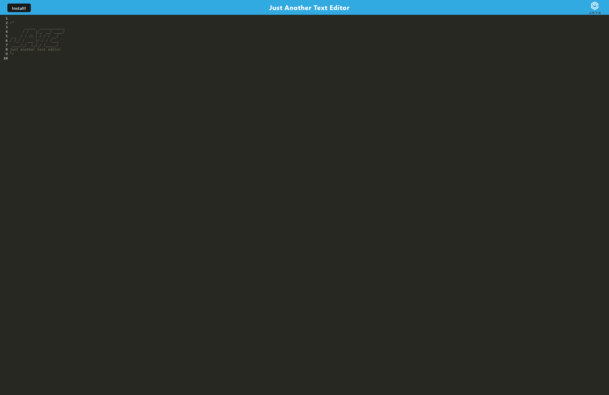

# PWA-Text-Editor

## Description

Provide a short description explaining the what, why, and how of your project. Use the following questions as a guide:

Text editor application that runs in the browser and can be installed on a users machine and used offline. This application is for users to be able to create notes and code snippets and reliably retrieve them for later use.
This application uses the PWA method.

## Installation

Click install button in top left of interface.

## Usage

Enter in any text in the interface after the logo

Deployed App URL: https://lovely-cuyahoga-valley-62381-1987b2f8438b.herokuapp.com/
